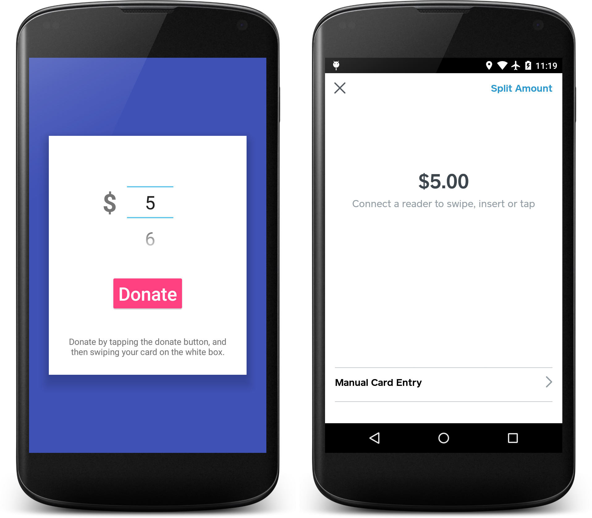

# OpenDonation
An Open Source donation app for Android making use of the [Square](https://squareup.com) card reader.



## Add a custom logo & background

To add your own custom logo to the top of the donation box, create a transparent `.png` image and copy it over the top of: `app/src/main/res/drawable/custom_logo.png`.

Then set the logo to appear in the file `MainActivity.java` by un-commenting out `setCustomLogo();`

To change the background colour, edit `colorPrimary` in `app/src/main/res/values/colors.xml`.

## Register your app
Don’t forget to register your app under your Square dev account: <https://connect.squareup.com/apps>

You’ll need your package name: `com.company.opendonation`

And the fingerprint of your debug certificate, which you can find with this one-liner:

```bash
$ keytool -list -v -keystore ~/.android/debug.keystore -alias androiddebugkey -storepass android -keypass android
```

Full instructions: <https://docs.connect.squareup.com/articles/android-app-fingerprint>

## Secrets
Secrets are stored in a file you’ll need to create:

```XML
<!-- Inside of `app/src/main/res/values/secrets.xml` -->
<?xml version="1.0" encoding="utf-8"?>
<resources>
    <string name="square_client_id">YOUR_CLIENT_ID</string>
</resources>
```

Usage:

```Java
getString(R.string.square_client_id);
```

```XML
<meta-data
    android:name="com.squareup"
    android:value="@string/square_client_id"/>
```

Follow the guide to get YOUR_CLIENT_ID: <https://docs.connect.squareup.com/articles/point-of-sale-api-android>

### Credits
Idea by [Ashleigh Hull](https://github.com/ashleyhull-versent).